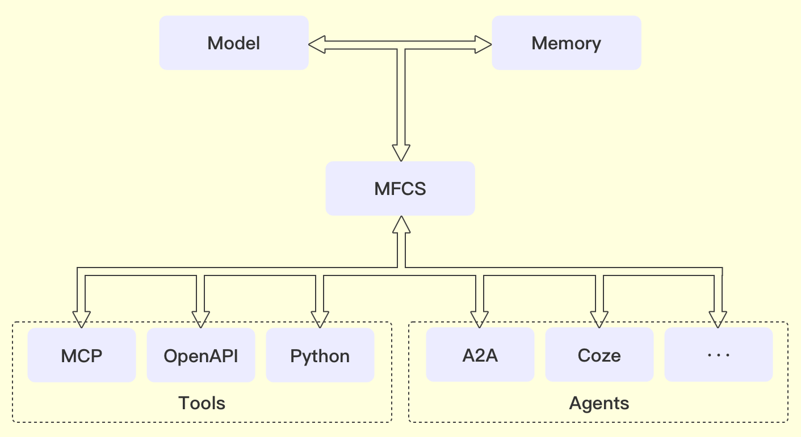

## 什么是MFCS
   MFCS（Model Function Calling Standard)是一个开源的标准协议，解决LLM与外部工具之间的交互，并定义了如何调用外部工具以及如何处理工具返回的结果。主要解决下面几个问题：
- 兼容性问题：不同大模型的 Function Calling 接口不统一，切换模型时需重复适配。
- 功能缺失问题：部分大模型（如 DeepSeek R1）不支持 Function Calling。
- 开发效率问题：业务开发需针对不同模型调整 Function Calling 逻辑，增加维护成本。
- 扩展性问题：现有 Function Calling 方案在工具数量、调用灵活性、监控能力等方面存在限制。
## 总体架构

MFS “model function calling standard”，以下是对架构图更准确的理解：
 
### 整体架构说明
 
这张图展示了一个以大语言模型（LLM）为核心的系统架构，强调了LLM与记忆模块（memory）、模型函数调用标准（MFCS）以及各种工具（Tools）、智能体之间的交互关系。

 
### 各部分详细解释
 
#### 1. Model：
大模型是整个系统的智能核心，例如像GPT-4、Deepseek、Qwen等。它通过对大量文本数据的学习，具备生成自然语言文本、理解用户意图等能力。
 
#### 2. memory（记忆模块）：
记忆模块对于LLM来说至关重要。它可以存储对话的上下文信息，例如用户之前的提问、模型的回答等。这样在处理新的输入时，LLM可以参考记忆模块中的信息，从而生成更连贯、更符合语境的回答。
 
#### 3. MFCS（Model Function Calling Standard）：
模型函数调用标准是一种规范，用于协调LLM和各种工具之间的交互。它定义了LLM如何调用外部工具的函数，以及如何处理这些工具返回的结果。通过MFCS，LLM可以利用外部工具与智能体功能来增强自身的能力。
 
#### 4. Tools（工具）：
- MCP：cluade推出的模型上下文协议，用于第三方工具对接。
 
- OpenAPI：通常指开放的应用程序编程接口，它允许不同的软件系统之间进行交互和数据共享。在这个系统中，LLM可以通过MFCS调用OpenAPI来获取外部服务的功能，例如获取天气数据、股票信息等。
 
- Python：作为一种强大的编程语言，Python有丰富的库和框架。在这个系统中，LLM可以通过MFCS调用Python脚本来执行各种复杂的任务，如数据分析、机器学习模型训练等。

#### 5. Agents（智能体）：
- A2A：Agent to Agent，协议是一种开源标准，旨在实现不同框架和供应商开发的AI智能体之间的无缝协作。MFCS也支持A2A协议的调用。

- Coze：通用的智能体平台，智能体可以提供API服务，MFCS可以通过开放的API完成智能体的调用。当然Coze也只是一个代表，本身MFCS是通用的标准，可以适配各种开放API的智能体平台。
 
### 交互流程
 
LLM与memory进行双向交互，即LLM可以读取memory中的信息，也可以将新的信息写入memory。然后，LLM和memory的信息通过MFCS进行整合和处理，MFCS根据模型的需求调用相应的Tools（如MCP、OpenAPI、Python ）来完成特定的任务。
 
这种架构设计使得LLM能够充分利用外部工具的能力，拓展其应用范围，提升处理复杂任务的能力。